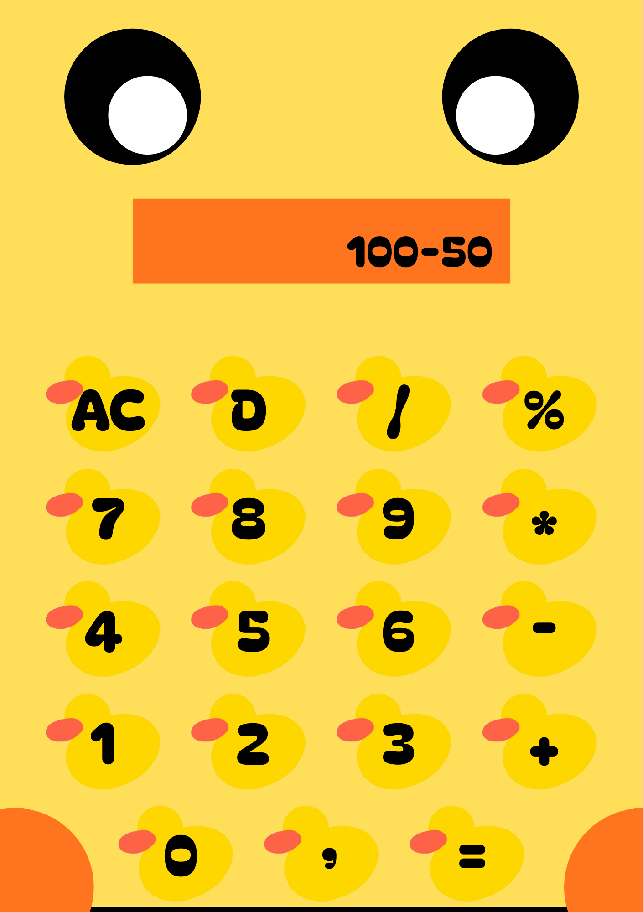
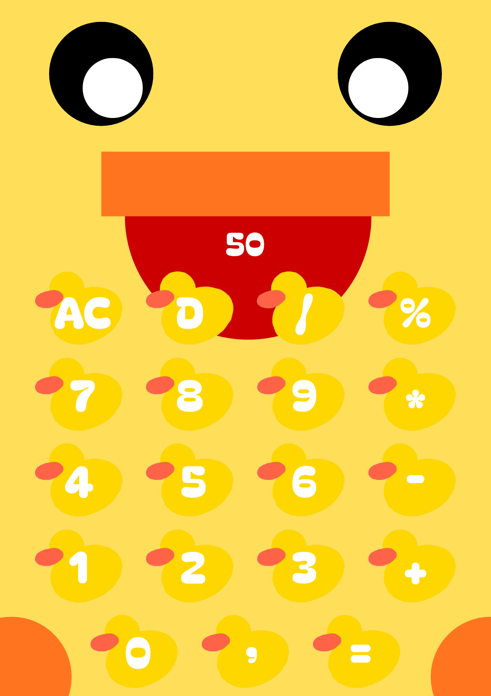
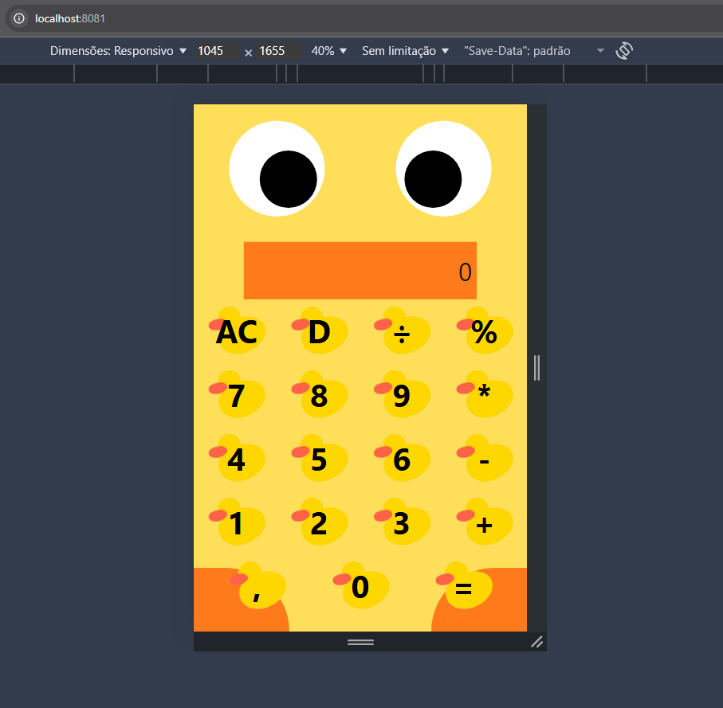

# PrjCalculadora
Projeto Calculadora Quack

                                                                                                                                                                                                                                                                                                                                                                                
Requisitos 
Funcionais:
1 - A calculadora deverá possuir as operações de adição, subtração, divisão, multiplicação e raíz quadrada.
2 - O usuário deverá ser capaz de deletar todos os números inseridos no display através de um único botão.
3 - O sistema deverá reproduzir um som de 'quack' ao pressionar todos os botões, menos o "=".
4 - Os números do display deverão ser exibidos no bico do pato.
5 - Ao selecionar um operador após informar um número, tanto o operador quanto os números selecionados deverão ser exibidos acima do número do display.
6 - Os olhos do pato deverão estar olhando para o bico.
7 - Os botões do teclado deverão ter formato de patinho.
8 - O sistema deverá exibir dois círculos nos cantos inferior direito e esquerdo na cor laranja, remetendo aos pés do pato.

Print da calculadora:

